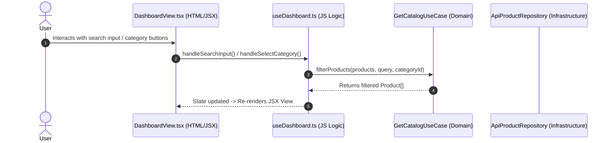

# Clean Architecture & Technical Method Guide

Welcome to the architectural specification for the **HungryMan Storefront Frontend**. This document provides an in-depth breakdown of the Clean Architecture pattern, technology stack, directory organization, component triplet separation, dependency rules, state management, and hybrid offline fallback mechanism.

---

## 🏛️ 1. Architecture Philosophy & Design Methodology

The HungryMan Frontend application is structured following Robert C. Martin's **Clean Architecture** tailored for modern React + TypeScript applications. 

### Key Objectives:
1. **Framework Independence**: Core business logic and domain entities are pure TypeScript, decoupled from React or any UI rendering framework.
2. **Testability**: Use cases and domain models can be tested in isolation without rendering DOM elements or initializing web servers.
3. **Dependency Rule**: Dependencies point strictly **inwards**. Outer layers (UI, HTTP adapters) depend on inner layers (Use Cases, Domain Entities). Inner layers have zero knowledge of outer layers.
4. **HTML / CSS / JS Separation**: UI components & views follow a strict 3-file triplet structure (`use<Component>.ts` for JS logic, `<Component>.module.css` for CSS styles, `<Component>.tsx` for HTML/JSX markup).
5. **Resiliency & Hybrid Strategy**: Seamless fallback between live REST microservices (e.g., `.NET Core` API Gateway) and local mock data repositories for zero-downtime offline previews.

```mermaid
graph TD
    subgraph Presentation Layer ["Presentation Layer (React 19)"]
        HOOK[useDashboard / useLogin - Logic]
        CSS[Module.css - Styles]
        VIEW[View & Component JSX Templates]
        CTX[React State Contexts / Controllers]
    end

    subgraph Core Domain Layer ["Core Domain Layer (Pure TS)"]
        UC[Application Use Cases]
        ENT[Domain Entities & Contracts]
    end

    subgraph Infrastructure Layer ["Infrastructure Layer (Adapters)"]
        HTTP[HttpClient / Fetch]
        REPO_IMPL[ApiAuthRepository / ApiProductRepository / SessionCart]
        MOCK[Mock Store Data Provider]
    end

    VIEW --> HOOK
    VIEW --> CSS
    HOOK --> CTX
    CTX --> UC
    UC --> ENT
    REPO_IMPL ..|implements|.. ENT
    UC --> REPO_IMPL
    REPO_IMPL --> HTTP
    REPO_IMPL --> MOCK
```

---

## 📁 2. Directory Structure & Component Triplet Layout

```
Frontend/src/
├── core/                                 # Clean Architecture Core Modules
│   ├── domain/                           # Enterprise & Business Domain Layer (Pure TS)
│   │   ├── entities/                     # Core Domain Models (Product, User, CartItem, AuthToken)
│   │   ├── repositories/                 # Abstract Repository Contracts (Interfaces)
│   │   └── usecases/                     # Business Logic Use Cases (GetCatalog, Login, ManageCart)
│   │
│   └── infrastructure/                   # Data & Infrastructure Layer (Adapters)
│       ├── http/                         # Low-level network adapter (HttpClient.ts)
│       ├── mocks/                        # Offline fallback data (MockStoreData.ts)
│       └── repositories/                 # Concrete Repositories (ApiAuth, ApiProduct, SessionCart)
│
├── presentation/                         # UI Presentation Layer (React Framework)
│   ├── components/                       # Reusable UI Controls (Hook + CSS Module + View)
│   │   ├── Hero/
│   │   │   ├── useHero.ts                # JS/TS Logic & Search Filter Handler
│   │   │   ├── Hero.module.css           # Glassmorphism & Search CSS Styles
│   │   │   ├── Hero.tsx                  # Clean HTML/JSX Template
│   │   │   └── index.ts                  # Component Barrel Export
│   │   ├── Navbar/
│   │   │   ├── useNavbar.ts              # Auth state & logout navigation hook
│   │   │   ├── Navbar.module.css         # Sticky navigation bar CSS styles
│   │   │   ├── Navbar.tsx                # Clean HTML/JSX Template
│   │   │   └── index.ts
│   │   └── ProductCard/
│   │       ├── useProductCard.ts         # Add to cart animation & stock status hook
│   │       ├── ProductCard.module.css    # Dish card & badge CSS styles
│   │       ├── ProductCard.tsx           # Clean HTML/JSX Template
│   │       └── index.ts
│   │
│   ├── context/                          # State Management Controllers (AuthContext, CartContext)
│   │
│   └── views/                            # Page Routes (Hook + CSS Module + View)
│       ├── Cart/                         # CartView.tsx + useCartView.ts + CartView.module.css
│       ├── Dashboard/                    # DashboardView.tsx + useDashboard.ts + DashboardView.module.css
│       ├── Login/                        # LoginView.tsx + useLogin.ts + LoginView.module.css
│       └── Profile/                      # ProfileView.tsx + useProfile.ts + ProfileView.module.css
│
├── services/                             # Legacy Facade Adapter (api.ts)
├── App.tsx                               # Router & Context Provider root
├── index.css                             # Global Design System (Tokens, Animations, Glassmorphism)
└── main.tsx                              # React DOM Entry Point
```

---

## 🛠️ 3. Technology Stack & Technical Methods

| Layer / Aspect | Technology / Library | Methodology & Details |
| :--- | :--- | :--- |
| **Build & Tooling** | Vite 6 + ESNext | Ultra-fast HMR dev server & optimized Rollup build. |
| **Language** | TypeScript 5.7 | Configured with `verbatimModuleSyntax` and `erasableSyntaxOnly` for robust type-safety. |
| **UI Architecture** | Component Triplet Pattern | Every component is split into `use<Name>.ts` (Logic), `<Name>.module.css` (Styles), and `<Name>.tsx` (View/HTML). |
| **UI Framework** | React 19 | Functional components with Hooks (`useMemo`, `useState`, `useEffect`, `useContext`). |
| **Styling System** | CSS Modules + Vanilla CSS | Isolated CSS module rules eliminating inline `<style>` tags, combined with CSS custom properties and glassmorphism. |
| **Icons** | Lucide React | Lightweight SVG icon library. |
| **Routing** | React Router v7 | Client-side SPA navigation with `ProtectedRoute` guards. |
| **Data Fetching** | Native `fetch` + `HttpClient` | Custom HTTP client wrapping requests with Request ID tracking, timestamps, and JWT Bearer tokens. |
| **Storage** | `localStorage` & `sessionStorage` | Session preservation across refreshes and tab isolation for cart items. |

---

## 🔄 4. Data Flow & Layer Interaction

Below is a detailed sequence of how user interactions flow through the Clean Architecture layers during catalog search and authentication.

### Data Flow Sequence: Component Triplet & Use Case



---

## 💎 5. Design Patterns & Best Practices

1. **Component Triplet Pattern**:
   Separates UI component logic into custom hooks (`use<Component>.ts`), styling into scoped CSS Modules (`<Component>.module.css`), and template markup into clean JSX views (`<Component>.tsx`).
2. **Repository Pattern (`IAuthRepository`, `IProductRepository`, `ICartRepository`)**:
   Hides implementation details of data persistence behind strict interfaces.
3. **Use Case Pattern (`LoginUseCase`, `GetCatalogUseCase`, `ManageCartUseCase`)**:
   Encapsulates single-responsibility business operations.
4. **Facade Pattern (`services/api.ts`)**:
   Provides backward-compatible adapter interfaces for smooth migration.
5. **Dependency Inversion Principle (DIP)**:
   High-level presentation components depend on abstract domain use cases, not concrete HTTP clients.

---

## ⚡ 6. Building & Running Locally

```bash
# Navigate to Frontend directory
cd Frontend

# Install dependencies (if needed)
npm install

# Start local Vite development server with HMR
npm run dev

# Run production TypeScript compilation & build verification
npm run build
```

---

*Document version: 2.1.0 — Component Triplet Refactoring (HTML, CSS, JS Separation).*
